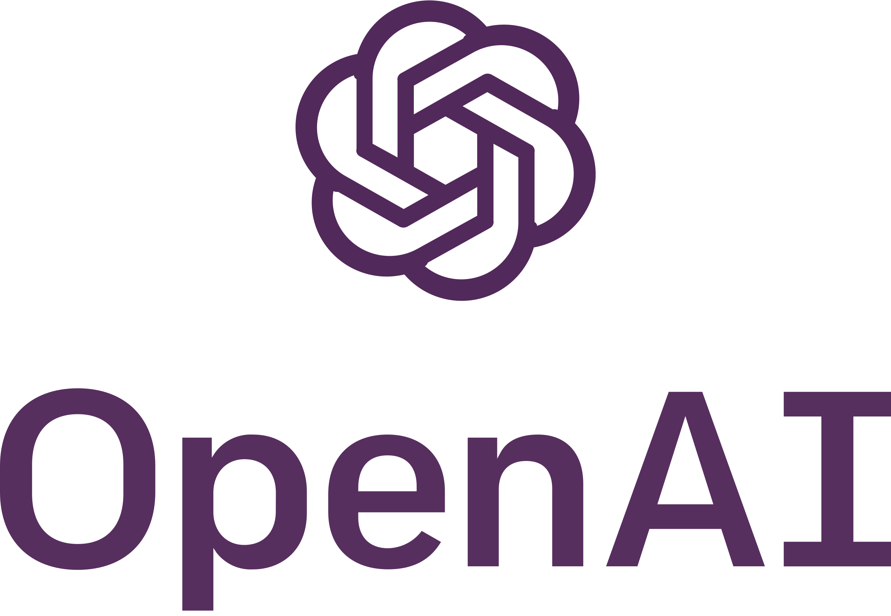

---
<br>
<br>
<br>

## How to use OpenAI
- AzureChatOpenAI  
設定model參數

```
from langchain_openai import AzureChatOpenAI
from dotenv import load_dotenv

load_dotenv()
get_env = os.getenv

model = AzureChatOpenAI(
    temperature=0.9,   
    api_key=get_env('API_KEY'),
    openai_api_version=get_env('OPENAI_API_VERSION'),
    azure_deployment=get_env('AZURE_DEPLOYMENT'),
    azure_endpoint=get_env('AZURE_ENDPOINT'),
)
```


### Agent
[Sample Project](src/agentTest)  
#### Step
1. 建立工具  
    客製化工具，讓Agent可以使用這些工具進行思考
   - [cwa.py](src/agentTest/crawler/cwa.py)  

    工具參數
   - [schema.py](src/agentTest/schema.py)  
2. 創建文本  
    - [sample_prompt.txt](src/agentTest/prompt.txt)  

    讓Agent根據先前的思考進行行動，並從該行動的結果中獲得觀察，形成 **思考→行動→觀察** 的流程    
    [Thought]–>[Action]–>[Observation]  

    並遵循以下六大策略：  
      1. 寫出清晰的指令  
      2. 提供參考文本  
      3. 將複雜的任務拆分為更簡單的子任務  
      4. 給模型時間「思考」  
      5. 使用外部工具  
      6. 系統地測試變更  

3. 執行主程式
   - [main.py](src/agentTest/main.py)


<br>
<br>
<br>

# 參考資料
[LLM Agents如何執行任務](https://hackmd.io/@YungHuiHsu/rkK52BkQp?utm_source=preview-mode&utm_medium=rec)